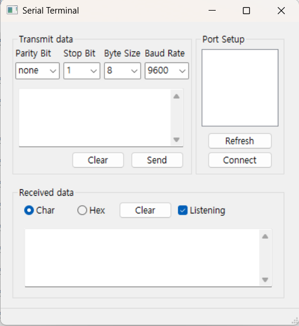

# 어플리케이션 사진


# 참고한 환경 설정
https://grr1.tistory.com/23
https://blog.naver.com/jdkim2004/223211503446
일부 lib파일은 변경 필요.

# 시리얼 포트 자동으로 감지
https://blog.naver.com/jangwn119/130040867497
https://yogyui.tistory.com/entry/MFCSetupAPI-%EC%9E%A5%EC%B9%98%EA%B4%80%EB%A6%AC%EC%9E%90Device-Manager-%EC%A0%95%EB%B3%B4-%EC%96%BB%EA%B8%B0

# release 버전 빌드
visual studio x64 native tools command prompt에서
```bash
cd C:\wxWidgets-3.2.8\build\msw
nmake /f makefile.vc BUILD=release SHARED=0 MONOLITHIC=0 TARGET_CPU=amd64
```

# 할 일
- [ ] OnRefresh 함수화
- [ ] Cntl + 키 이벤트 추가 (현재 B C D)